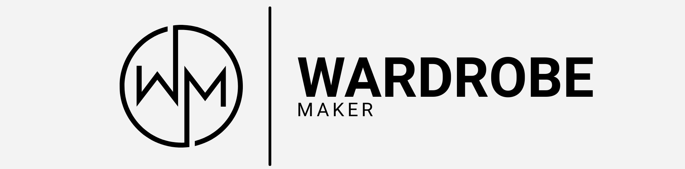
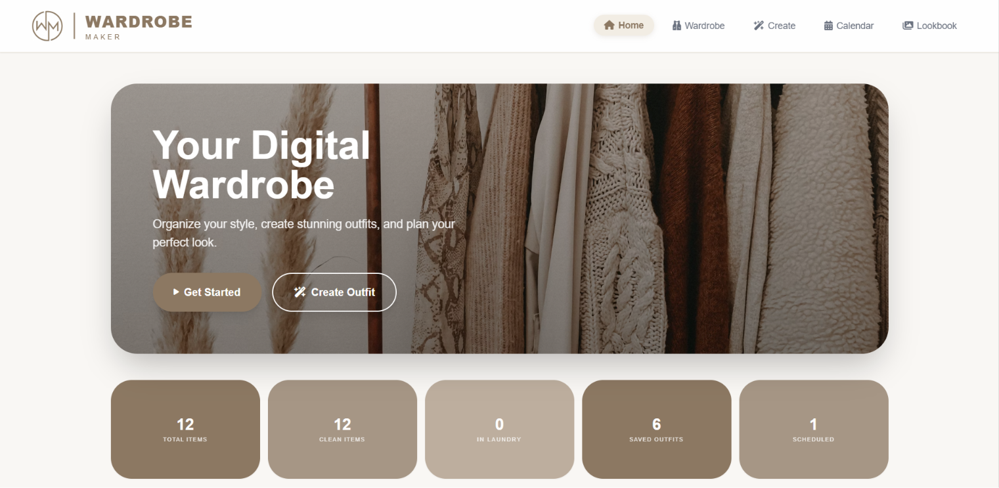
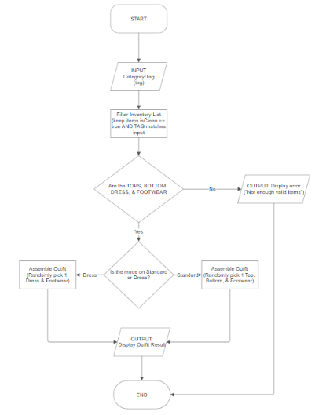
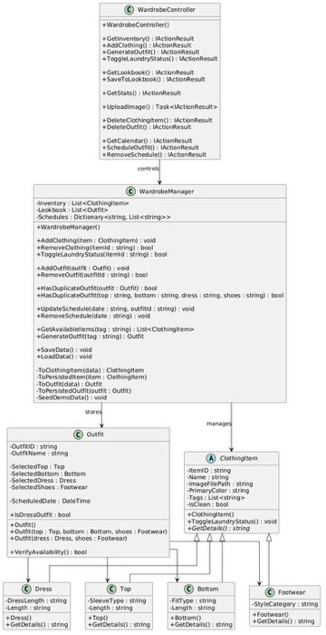

> A full-stack wardrobe management app for organizing clothes, building outfits, planning schedules, and curating a personal lookbook.

---

## ✨ Features

### 👚 Wardrobe Management
- Add clothing items with **name, color, tags, category, and photo upload**.
- Organize inventory across **Top, Bottom, Dress, and Footwear** categories.
- Toggle laundry status between **Clean** and **In Laundry**.
- Remove items with smooth UI transitions.

### 🧵 Outfit Builder
- Build outfits in **Standard mode** (Top + Bottom + Footwear) or **Dress mode** (Dress + Footwear).
- Use **Quick Roll** for random clean-item combinations.
- Save custom outfits to Lookbook with duplicate prevention.

### 📅 Calendar Planning
- Schedule saved outfits by date.
- View daily planned looks in a calendar sidebar.
- Remove scheduled looks directly from the selected day.

### 📚 Lookbook
- Browse all saved outfits in a visual card gallery.
- View outfit composition and readiness state.
- Delete individual looks or clear all saved looks.

---

## 🚀 Getting Started

### Requirements
- **.NET SDK 10+**
- A modern browser (Chrome, Edge, Firefox, Safari)
- Optional: VS Code Live Server extension

### Run the app
1. Open the solution: **`Wardrobe Maker.sln`**
2. Start backend from **`WardrobeMaker\Backend`** using **`dotnet run`**
3. Open frontend at **`WardrobeMaker\Frontend\html\index.html`** (Live Server or browser)

> **Tip:** Keep the backend running before opening frontend pages to avoid API connection issues.

---

## 📸 Screenshots

---

## 🔀 Flowchart (Create Outfit Function)

---

## 🧩 UML Class Diagram

---

## 🏗️ Tech Stack

- **Backend:** ASP.NET Core Web API (C#)
- **Frontend:** HTML, CSS, Vanilla JavaScript
- **Data Storage:** JSON-based persistence (`wardrobe-data.json`)

---

## 👥 Team

<table>
  <tr>
    <td align="center">
      
       
      <b>Lunar, Von Andrei G.</b>
       
      <b>Project Manager</b>
       
      
       
      
       
      
    </td>
    <td align="center">
      
       
      <b>Miranda, Christine Nicole</b>
       
      <b>GUI</b>
       
      
       
      
       
      
    </td>
    <td align="center">
      
       
      <b>Arazula, Rjay D.</b>
       
      <b>Logic Developer / Tester</b>
       
      
       
      
       
      
    </td>
  </tr>
</table>

---

## 📝 Notes

> This project was developed for **AOOP (Advanced Object-Oriented Programming)** and demonstrates practical OOP concepts through a full-stack application.

